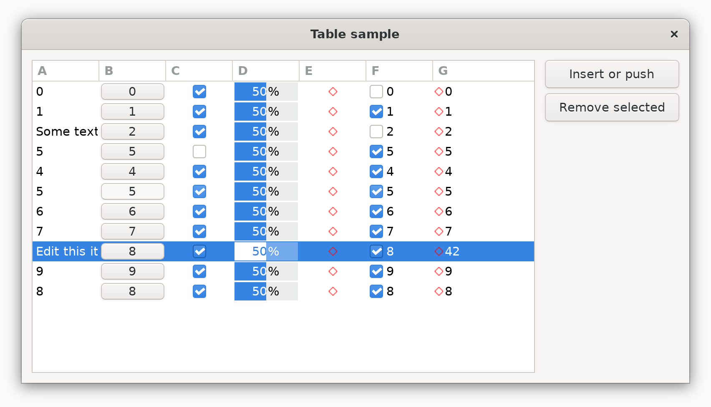

  

---

AXE是一个由C语言实现的轻量级的可移植实用程序库，它提供了很多基础功能包括常用的数据结构、对象模型、系统接口封装、网络通信和用户界面等。正如该工程的名字所表达的，它可以通过略显笨拙但简单粗暴的方式完成预期的工作。

## 编译和安装

该工程目前可以在流行的类Unix环境包括MSYS2、Linux、FreeBSD、OSX等进行编译，编译之前首先执行*configure*脚本进行配置，然后通过*make*(1)编译和安装。

```
$ cd axe
$ ./configure
$ make
$ sudo make install
```

编译结束后，在*lib*目录会生成一些库文件，他们包括

| 库文件       | 描述 |
|---           |---   |
| libaxcore.a  | 基础功能 |
| libaxut.a    | 单元测试 |
| libaxnet.a   | 套接字和事件驱动 |
| libaxkit.a   | 系统接口兼容 |
| libaxgui.a   | 图形用户界面 |

在这些模块中，除 *axgui* 依赖了第三方程序[libui-ng](https://github.com/libui-ng/libui-ng)以外，其它模块无任何第三方的接口依赖。其中 *axcore* 基于纯C99标准编写，并作为其他几个模块的共同依赖。而其他模块之间互相不存在依赖。

将不同操作系统的原生GUI进行统一接口封装，通过纯C语言完成存在很多难题。比如在OSX系统中，界面的创建需要通过Objective-C语言调用Cocoa的接口。而在Linux下，带有图形用户界面的程序通常使用GTK+来创建界面，但GTK+已经依赖于强大的基础库 *glib* ，其完整性、性能和灵活性都要高于我们的实现，直接通过 *glib* 对界面进行可移植封装可能是更好的方式。所以综合来看，*libui* 是一个不错的GUI工具，它在不同的平台通过原生GUI接口实现图形界面，并且在GUI的程序的轻便性、功能完整性和接口的灵活性之间达到了不错的平衡。在 *configure* 阶段会检查 *libui.h* 的存在性，如果不存在则放弃对 *axgui* 模块的编译。

开发者可以选择性的引用指定的模块，通过执行 `configure --help` 获取更多配置信息。

## 使用方法

您可以直接通过引入相关头文件来使用特定的功能，下面是一个样例程序，这其中包括一些有趣的特性，比如链表、迭代器算法、对象转储和容器遍历等操作. 在编译客户程序时需要通过加入编译参数`-lax*`来连接相关的库文件. 详细的帮助文档请参考MAN手册页，它们位于工程目录的 *man/man3* 目录下，或参考单元测试程序和附带的样例程序，它们分别位于工程目录下的 *test* 和 *sample* 目录. 

*axui* 模块支持基本的用户界面控件，下面是一个表格示例的截图，示例源代码位于 `sample/ui/table.c`



## 头文件描述

### axcore 头文件列表

| 名称              | 描述 |
|---                |---   |
| ax/type/one.h     | 根类型抽象 |
| ax/type/any.h     | 可序列化对象抽象 |
| ax/type/box.h     | 可迭代容器抽象 |
| ax/type/seq.h     | 线性表抽象 |
| ax/type/str.h     | 字符串抽象 |
| ax/type/map.h     | 映射表抽象 |
| ax/type/trie.h    | 字典树抽象 |
| ax/type/tube.h    | 单进单出管道抽象 |
| ax/class.h        | 类型构造相关宏 |
| ax/def.h          | 基础声明 |
| ax/unicode.h      | Unicode支持 |
| ax/flow.h         | 高级流程控制 |
| ax/ring.h         | 模板化的循环队列 |
| ax/heap.h         | 模板化的堆 |
| ax/trick.h        | 魔法宏 |
| ax/narg.h         | 参数测量宏 |
| ax/detect.h       | 编译环境探测宏 |
| ax/debug.h        | 断言 |
| ax/arraya.h       | 匿名的栈数组 |
| ax/oper.h         | 算子 |
| ax/dump.h         | 可视化转储 |
| ax/log.h          | 打印 |
| ax/algo.h         | 基于迭代器的算法 |
| ax/pred.h         | 算法的谓词和参数绑定 |
| ax/trait.h        | 数值类型的特性描述 |
| ax/iter.h         | 迭代器 |
| ax/mem.h          | 内存和串的操作 |
| ax/u1024.h        | 1024位无符号整数运算 |
| ax/array.h        | 静态数组容器 |
| ax/vector.h       | 向量表容器 |
| ax/deq.h          | 双端队列容器 |
| ax/list.h         | 双链表容器 |
| ax/hmap.h         | 散列表容器 |
| ax/avl.h          | 自平衡树容器 |
| ax/rb.h           | 红黑树容器 |
| ax/string.h       | 字符串容器 |
| ax/btrie.h        | 平衡字典树容器 |
| ax/queue.h        | 队列 |
| ax/stack.h        | 栈 |
| ax/pque.h         | 优先队列 |
| ax/base64.h       | BASE64编解码 |
| ax/iobuf.h        | IO缓冲区 |

### axnet 头文件列表

| 名称              | 描述 |
|---                |---   |
| ax/reactor.h      | Reactor事件模型 |
| ax/event.h        | 事件相关操作 |
| ax/socket.h       | 套接字操作 |

### axkit 头文件列表

| 名称              | 描述 |
|---                |---   |
| ax/thread.h       | 线程操作 |
| ax/cond.h         | 条件变量 |
| ax/once.h         | 一次初始化 |
| ax/mutex.h        | 互斥量 |
| ax/rwlock.h       | 读写锁 |
| ax/sem.h          | 信号量 |
| ax/tpool.h        | 线程池 |
| ax/tss.h          | 线程本地存储 |
| ax/ctrlc.h        | 终端的中断事件 |
| ax/dir.h          | 遍历文件夹 |
| ax/edit.h         | 终端行编辑 |
| ax/errno.h        | 跨平台的错误代码 |
| ax/ini.h          | INI配置文件操作 |
| ax/io.h           | 输入输出操作 |
| ax/lib.h          | 加载动态链接程序 |
| ax/option.h       | 命令行解析 |
| ax/path.h         | 路径字符串操作 |
| ax/proc.h         | 进程支持 |
| ax/stat.h         | 获取文件信息 |
| ax/sys.h          | 文件系统操作等 |
| ax/tcolor.h       | 终端颜色支持 |
| ax/types.h        | 类型定义 |
| ax/uchar.h        | 可移植UNICODE字符串 |
| ax/log2.h         | 高级的日志打印，替换log.h |

### axgui 头文件列表

| 名称              | 描述 |
|---                |---   |
| ui/ui.h           | 全局UI操作 |
| ui/widget.h       | 控件基类抽象 |
| ui/window.h       | 窗口操作 |
| ui/types.h        | UI相关类型定义 |
| ui/box.h          | 线性布局 |
| ui/button.h       | 按钮 |
| ui/checkbox.h     | 复选框 |
| ui/colorpicker.h  | 颜色拾取按钮 |
| ui/combobox.h     | 复选框 |
| ui/entry.h        | 文本框 |
| ui/form.h         | 表单 |
| ui/group.h        | 组控件 |
| ui/image.h        | 设备无关图像 |
| ui/label.h        | 文件控件 |
| ui/menu.h         | 菜单控件 |
| ui/radiobox.h     | 单选按钮组 |
| ui/selectentry.h  | 下拉输入框 |
| ui/slider.h       | 滑动输入条 |
| ui/spinbox.h      | 数量输入框 |
| ui/table.h        | 表格 |
| ui/model.h        | 表格的模型数据 |
| ui/timepicker.h   | 时间提取按钮 |

### axut 头文件列表

| 名称              | 描述 |
|---                |---   |
| ut/case.h         | 测试用例 |
| ut/suite.h        | 测试用例套件 |
| ut/runner.h       | 测试用例套件的执行容器 |

## LICENSE

该软件程序基于MIT协议发布. 参考[LICENSE](./LICENSE)文件

## AUTHOR

李希林 <lixilin@gmx.com>

